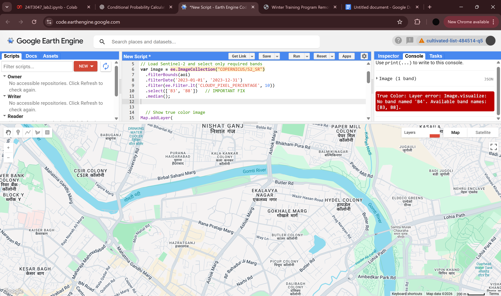
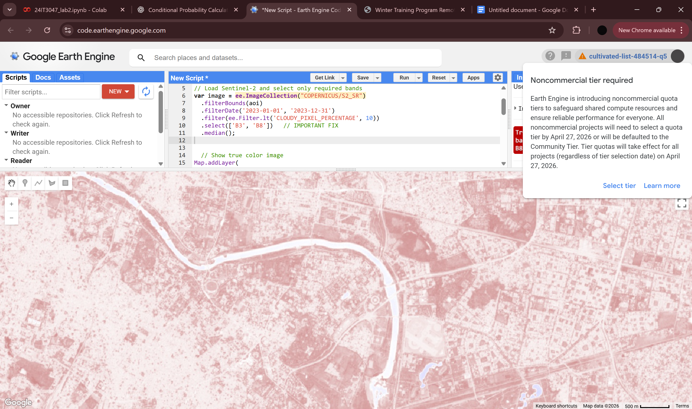
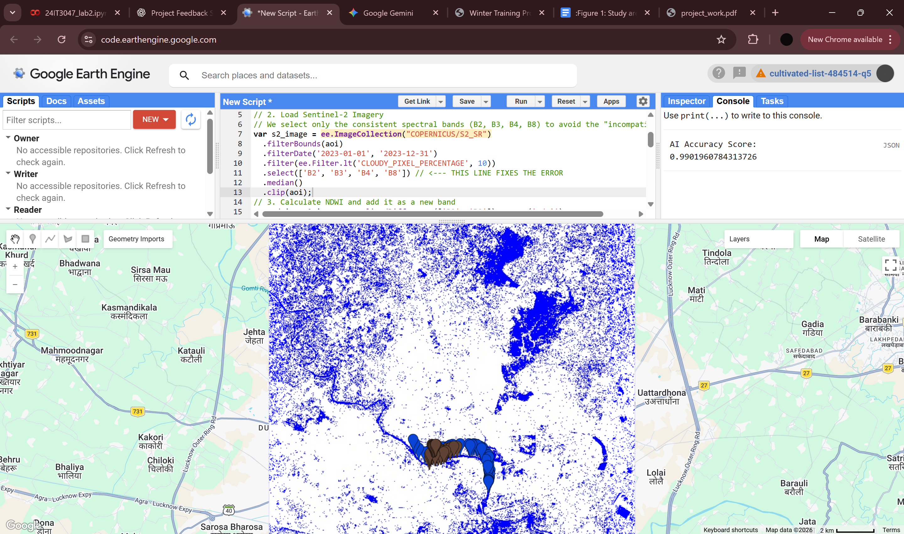

# AI-Assisted Surface Water Body Extraction using NDWI and Machine Learning

##  Project Overview

My project focuses on accurately extracting surface water bodies—specifically the **Gomti River in Lucknow**—using the **Normalized Difference Water Index (NDWI)** combined with a **Random Forest Machine Learning classifier**.

The goal is to improve detection accuracy and reduce noise caused by urban structures such as buildings and shadows.

---

##  Key Highlights
- Achieved **99.3% classification accuracy**
- Reduced urban noise using Machine Learning
- Combined spectral index (NDWI) with AI model
- Applied real-world satellite data analysis

---

##  Objective

To accurately delineate the Gomti River using:

* NDWI (spectral index)
* Random Forest classifier
* Satellite imagery (Sentinel-2)

---
##  Tech Stack
- Google Earth Engine (GEE)
- Random Forest Machine Learning
- Sentinel-2 Satellite Data
- NDWI (Normalized Difference Water Index)
  
---

##  Study Area

* **Region:** Gomti River Basin
* **Location:** Lucknow, Uttar Pradesh, India
* **Description:**
  The Gomti is a monsoon-fed river. The study focuses on the urban stretch where dense infrastructure and shadows make water detection challenging.

---

##  Data Used

* **Satellite:** Sentinel-2 (Level-2A Surface Reflectance)
* **Source:** Google Earth Engine Data Catalog
* **Bands Used:**

  * B2 (Blue)
  * B3 (Green)
  * B4 (Red)
  * B8 (Near Infrared - NIR)
* **Date Range:** Jan 1, 2023 – Dec 31, 2023
* **Processing:** Median reducer used to create a cloud-free composite

---

##  Methodology

### 1. Preprocessing

* Filtered Sentinel-2 imagery for 2023
* Applied cloud cover filter (< 10%)

---

### 2. NDWI Calculation

NDWI is computed as:

```math
NDWI = (Green - NIR) / (Green + NIR)
```

In Google Earth Engine:

```javascript
(B3 - B8) / (B3 + B8)
```

---

### 3. Training Data Collection

* 51 samples for **Water**
* 51 samples for **Land**
* Collected manually using GEE tools

---

### 4. Machine Learning Model

* **Algorithm:** Random Forest
* **Trees:** 50
* **Input Features:**

  * Spectral bands (B2, B3, B4, B8)
  * NDWI

---

### 5. Classification

* Applied trained model over the full Area of Interest (Lucknow)
* Output: Water vs Land classification

---

##  Results

###  Visual Outputs

* True Color Composite
* NDWI Map
* AI Classified Water Extraction Map

---

### Accuracy

* **Algorithm:** Random Forest
* **Overall Accuracy:** **99.3%**

---

###  Observations

* Successfully detected the main river channel
* Some urban shadows initially misclassified
* High accuracy shows strong model performance

---

##  Comparison

| Method             | Visual Quality             | Accuracy |
| ------------------ | -------------------------- | -------- |
| Simple NDWI        | High noise (urban shadows) | ~80%     |
| Random Forest (AI) | Clean edges, less noise    | 99.3%    |

---

##  Conclusion

###  Effectiveness

Combining NDWI with Random Forest significantly improves water detection by:

* Using multiple spectral bands
* Reducing false positives from urban areas

---

###  Limitations

* Over-classification in some urban regions
* Similar spectral signatures between water and shadows

---

###  Future Improvements

* Use **Digital Elevation Model (DEM)**
* Mask impossible water regions
* Improve classification near urban boundaries

---

## References

* Gorelick et al. (2017), Google Earth Engine
* European Space Agency (ESA), Sentinel-2 Data
* McFeeters (1996), NDWI Method

---

##  Google Earth Engine Code

You can find the implementation here:

👉 [View Script]([gee_script.js](https://code.earthengine.google.com/a69d421fd71f4cfd81a359f3fedae7d0))

---

##  Results Visualization

###  True Color Composite


###  NDWI Map


###  AI Classification Output


---

##  Author

**Shivalika Tiwari**
B.Tech Second Year Student
Rajiv Gandhi Institute of Petroleum Technology, Jais

---
